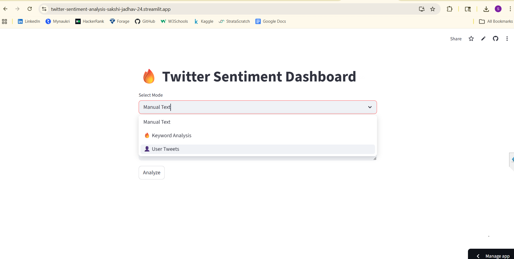
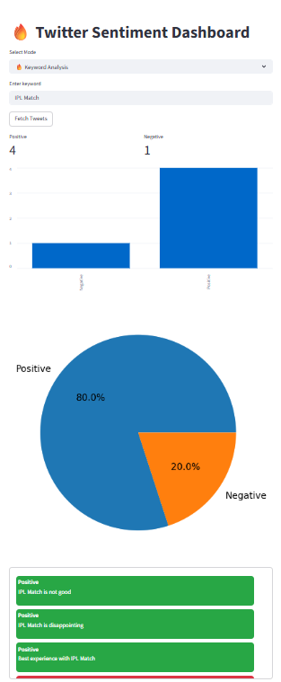

#  Real-Time Sentiment Analysis on Twitter Data Dashboard

## 📌 Project Overview

This project is a **Streamlit-based dashboard** that performs sentiment analysis on Twitter-like data.

It uses **Natural Language Processing (NLP)** and a **Machine Learning model** to classify text into:
- Positive 😊
- Negative 😠

The application provides an interactive interface where users can:
- Analyze custom text
- Analyze keyword-based tweets
- Analyze user tweets

---

## 📂 Project Structure

```
Twitter-Sentiment-Analysis/
│
├── app.py                # Main Streamlit application
├── model.pkl            # Trained ML model
├── vectorizer.pkl       # TF-IDF vectorizer
├── requirements.txt     # Dependencies
├── README.md            # Documentation
│
└── Images/
    ├── dashboard.png
    ├── result.png
```

---

## 🛠️ Tools and Technologies

- Python 🐍  
- Streamlit  
- Pandas  
- Scikit-learn  
- NLTK  
- Matplotlib  

---

## 🚀 Features

- Keyword-based sentiment analysis  
- User tweet sentiment analysis  
- NLP preprocessing (text cleaning, stopword removal)  
- Machine learning-based prediction  
- Interactive dashboard  
- Data visualization using charts  
- Stable execution with fallback data handling  

---

## 📸 Screenshots

### 📊 Dashboard


### 📈 Results


---

## ⚙️ How It Works

1. User selects analysis type  
2. Input is taken (text, keyword, or username)  
3. Text is cleaned using NLP techniques  
4. TF-IDF vectorization is applied  
5. Model predicts sentiment  
6. Results are displayed with charts  

---

## 📌 Conclusion

This project demonstrates how sentiment analysis can be implemented using **Machine Learning and NLP techniques**.

It provides a simple and interactive way to understand public opinion through a dashboard interface.

---

## 🔮 Future Improvements

- Integration with official Twitter API  
- Addition of neutral sentiment class  
- Improved UI design  
- Deployment with real-time data pipeline  

---

## 👩‍💻 Author

**Sakshi Jadhav**
